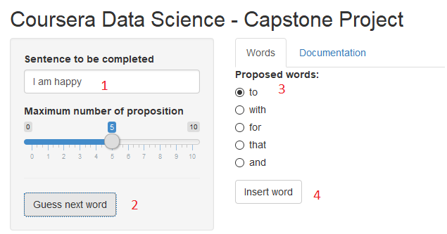

Data Science Capstone
========================================================
author: Daniel b.
date: 25/05/2018
autosize: true

Introduction
========================================================

The goal of this  project is to build a shiny application that is able to predict the next word based on the beginning of a sentence

The data used in developing this functionality were various English texts from twitter, news, and blog sources. For more information on the source, please see http://www.corpora.heliohost.org/aboutcorpus.html.

The Shiny App is available here: https://danielbrule.shinyapps.io/CapstoneDS/

To use the app, simply type a word, phrase, or sentence then select the number of proposition you want and select "Guess next word". You can then select the word you want and click on insert word. The word will be added to your current phrase 

Data preparation
========================================================

The data used in developing this functionality were various English texts from twitter, news, and blog sources. For more information on the source, please see http://www.corpora.heliohost.org/aboutcorpus.html.

40% of the data has been used to create the model. The following steps has been followed in order to prepare the data: all the strings have been put to lower, p unctuations and Number have been removed and the strings have been split in "sentence"

Then tables of the most frequent n-grams were created (3-gram, 4-gram, 5-gram and 6-gram). Each table was sorted according to frequency, so that the most frequently occuring n-gram was at the top.

In order to reduce the size of the files only n-gram with an occurence of more than 1 has been kept

Algorithm 
========================================================

The user's input is cleaned and normalized: converted to lowercase, and punctuation, numbers, and whitespace removed. 
The app then determines how many words the user has entered.
Based on this it will try to see if it fit a 6 grams, if not it will try a 5-gram etc. until it found some words to propose 

The App 
========================================================
The steps to use the Apps are straight forward:
1. Type the beginning of your sentence
2. Click on button "Guess next word"
3. Select the worrd you think is the correct one 
4. Click on button insert word 

