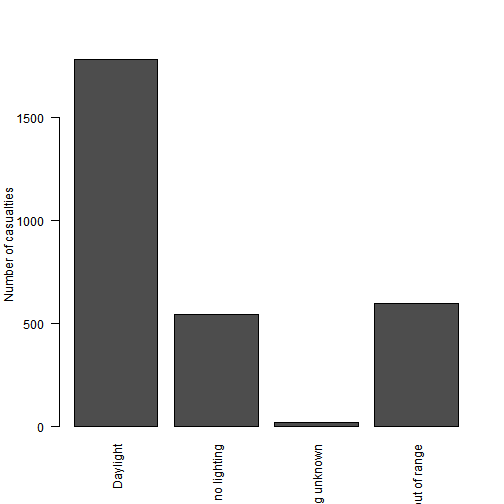
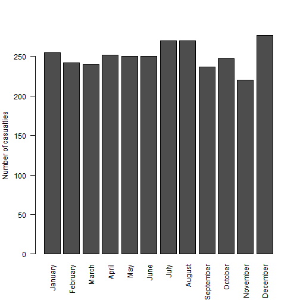

Week4 Presentation
========================================================
author: Daniel 
date: 20/04/2018
autosize: true

Introduction
========================================================

The goal of this slide deck is to visualise the causes of fatal injuries 
in UK in 2016 

For this goal we will used the road safety dataset published on the open data 
catalogue of UK 

http://data.dft.gov.uk/road-accidents-safety-data/dftRoadSafety_Accidents_2016.zip

Visualisation of fatal accidents based on light conditions 
========================================================
Here we can see that most of the fatal accidents occurs during daylight 

Visualisation of fatal accidents throughout the year
========================================================
Here we can see that there is a little bit more accident in summer and in December

Conclusion
========================================================
based on the two previous slides it appears that most of the accidents happens 
during day and that there is a little bit more accident in summer and in December

