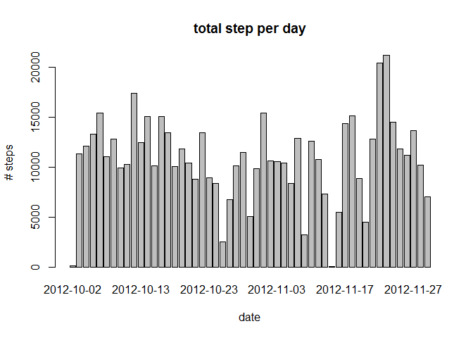
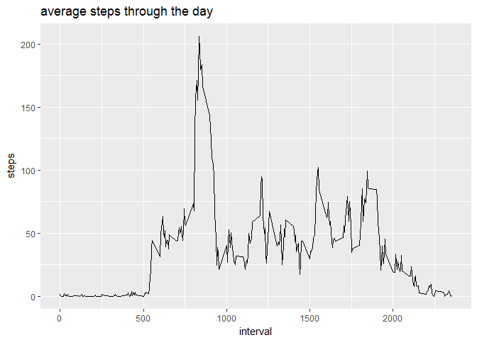
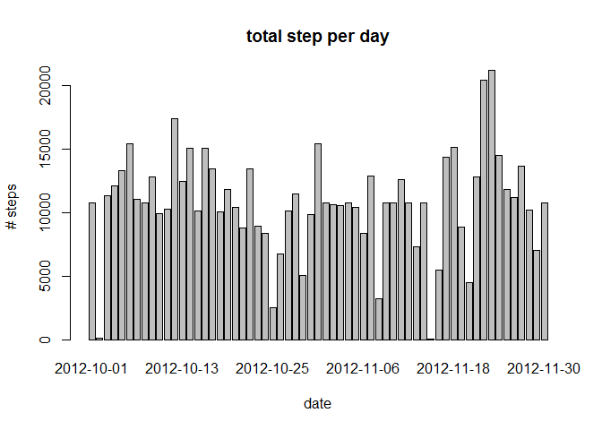
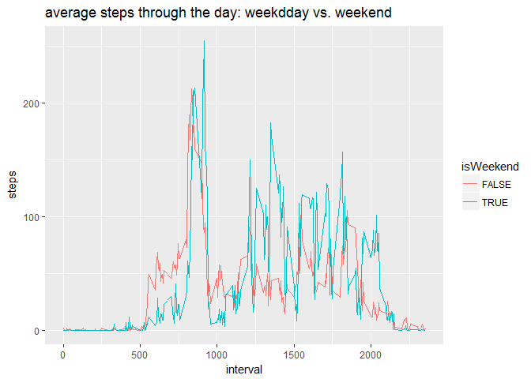

#loading and preprocessing data 

##initialise the environment 

```r
library(ggplot2)
setwd("C:/datasciencecoursera/ReproducibleResearche/CourseProject1")
```


##load and proprocessing data


```r
dActivity <- read.csv("activity.csv")
#set date format 
dActivity$date <- as.Date(dActivity$date)
dActivity$interval2 <- paste(as.integer(dActivity$interval / 100), formatC(dActivity$interval %% 100, width = 2, flag = 0), sep =":")
```


#Q1 What is mean total number of steps taken per day?

##Q1.1 Calculate the total number of steps taken per day

```r
dStepsPerDay <- aggregate(steps~date, data = dActivity, FUN = sum, na.rm = TRUE)
dStepsPerDay
```

```
##          date steps
## 1  2012-10-02   126
## 2  2012-10-03 11352
## 3  2012-10-04 12116
## 4  2012-10-05 13294
## 5  2012-10-06 15420
## 6  2012-10-07 11015
## 7  2012-10-09 12811
## 8  2012-10-10  9900
## 9  2012-10-11 10304
## 10 2012-10-12 17382
## 11 2012-10-13 12426
## 12 2012-10-14 15098
## 13 2012-10-15 10139
## 14 2012-10-16 15084
## 15 2012-10-17 13452
## 16 2012-10-18 10056
## 17 2012-10-19 11829
## 18 2012-10-20 10395
## 19 2012-10-21  8821
## 20 2012-10-22 13460
## 21 2012-10-23  8918
## 22 2012-10-24  8355
## 23 2012-10-25  2492
## 24 2012-10-26  6778
## 25 2012-10-27 10119
## 26 2012-10-28 11458
## 27 2012-10-29  5018
## 28 2012-10-30  9819
## 29 2012-10-31 15414
## 30 2012-11-02 10600
## 31 2012-11-03 10571
## 32 2012-11-05 10439
## 33 2012-11-06  8334
## 34 2012-11-07 12883
## 35 2012-11-08  3219
## 36 2012-11-11 12608
## 37 2012-11-12 10765
## 38 2012-11-13  7336
## 39 2012-11-15    41
## 40 2012-11-16  5441
## 41 2012-11-17 14339
## 42 2012-11-18 15110
## 43 2012-11-19  8841
## 44 2012-11-20  4472
## 45 2012-11-21 12787
## 46 2012-11-22 20427
## 47 2012-11-23 21194
## 48 2012-11-24 14478
## 49 2012-11-25 11834
## 50 2012-11-26 11162
## 51 2012-11-27 13646
## 52 2012-11-28 10183
## 53 2012-11-29  7047
```

##Q1.2 Make a histogram of the total number of steps taken each day

```r
barplot(dStepsPerDay$steps, 
        names.arg = dStepsPerDay$date, 
        main = "total step per day", 
        ylab = "# steps", 
        xlab = "date")
```

<!-- -->

##Q1.3 Calculate and report the mean and median of the total number of steps taken per day

```r
dMeanStepsPerDay   <- aggregate(steps~date, data = dActivity, FUN = mean)
dMedianStepsPerDay <- aggregate(steps~date, data = dActivity, FUN = median)
dMeanMedStepsPerDay <- merge(dMeanStepsPerDay, dMedianStepsPerDay, by = "date")
colnames(dMeanMedStepsPerDay) <- c("date", "mean", "median")
dMeanMedStepsPerDay
```

```
##          date       mean median
## 1  2012-10-02  0.4375000      0
## 2  2012-10-03 39.4166667      0
## 3  2012-10-04 42.0694444      0
## 4  2012-10-05 46.1597222      0
## 5  2012-10-06 53.5416667      0
## 6  2012-10-07 38.2465278      0
## 7  2012-10-09 44.4826389      0
## 8  2012-10-10 34.3750000      0
## 9  2012-10-11 35.7777778      0
## 10 2012-10-12 60.3541667      0
## 11 2012-10-13 43.1458333      0
## 12 2012-10-14 52.4236111      0
## 13 2012-10-15 35.2048611      0
## 14 2012-10-16 52.3750000      0
## 15 2012-10-17 46.7083333      0
## 16 2012-10-18 34.9166667      0
## 17 2012-10-19 41.0729167      0
## 18 2012-10-20 36.0937500      0
## 19 2012-10-21 30.6284722      0
## 20 2012-10-22 46.7361111      0
## 21 2012-10-23 30.9652778      0
## 22 2012-10-24 29.0104167      0
## 23 2012-10-25  8.6527778      0
## 24 2012-10-26 23.5347222      0
## 25 2012-10-27 35.1354167      0
## 26 2012-10-28 39.7847222      0
## 27 2012-10-29 17.4236111      0
## 28 2012-10-30 34.0937500      0
## 29 2012-10-31 53.5208333      0
## 30 2012-11-02 36.8055556      0
## 31 2012-11-03 36.7048611      0
## 32 2012-11-05 36.2465278      0
## 33 2012-11-06 28.9375000      0
## 34 2012-11-07 44.7326389      0
## 35 2012-11-08 11.1770833      0
## 36 2012-11-11 43.7777778      0
## 37 2012-11-12 37.3784722      0
## 38 2012-11-13 25.4722222      0
## 39 2012-11-15  0.1423611      0
## 40 2012-11-16 18.8923611      0
## 41 2012-11-17 49.7881944      0
## 42 2012-11-18 52.4652778      0
## 43 2012-11-19 30.6979167      0
## 44 2012-11-20 15.5277778      0
## 45 2012-11-21 44.3993056      0
## 46 2012-11-22 70.9270833      0
## 47 2012-11-23 73.5902778      0
## 48 2012-11-24 50.2708333      0
## 49 2012-11-25 41.0902778      0
## 50 2012-11-26 38.7569444      0
## 51 2012-11-27 47.3819444      0
## 52 2012-11-28 35.3576389      0
## 53 2012-11-29 24.4687500      0
```


# hat is the average daily activity pattern?
## Make a time series plot (i.e. type = "l") of the 5-minute interval (x-axis) and the average number of steps taken, averaged across all days (y-axis)

```r
dStepsPerInterval <- aggregate(steps~interval, data = dActivity, FUN = mean, na.rm = TRUE)
dStepsPerInterval$interval2 <- paste(as.integer(dStepsPerInterval$interval / 100), formatC(dStepsPerInterval$interval %% 100, width = 2, flag = 0), sep =":")

ggplot(data = dStepsPerInterval, aes(x = interval, y = steps)) + 
    geom_line() + 
    ggtitle("average steps through the day")
```

<!-- -->
## Which 5-minute interval, on average across all the days in the dataset, contains the maximum number of steps?

```r
dStepsPerInterval[which.max(dStepsPerInterval$steps), c("interval2", "steps")]
```

```
##     interval2    steps
## 104      8:35 206.1698
```

#Q3Imputing missing values
Note that there are a number of days/intervals where there are missing values (coded as NA). The presence of missing days may introduce bias into some calculations or summaries of the data.


##Q3.1 Calculate and report the total number of missing values in the dataset (i.e. the total number of rows with NAs)

```r
sum(!complete.cases(dActivity))
```

```
## [1] 2304
```

```r
sum(is.na(dActivity$date))
```

```
## [1] 0
```

```r
sum(is.na(dActivity$interval))
```

```
## [1] 0
```

```r
sum(is.na(dActivity$steps))
```

```
## [1] 2304
```
it appears that only steps has missing value 

##Q3.2 Devise a strategy for filling in all of the missing values in the dataset. The strategy does not need to be sophisticated. For example, you could use the mean/median for that day, or the mean for that 5-minute interval, etc.
##Q3.3 Create a new dataset that is equal to the original dataset but with the missing data filled in.

Now, use the mean of the total '5-minute interval' ... to fill the Na's and make a histogram of the total number of steps taken each day

```r
dMeanStepsPerInterval   <- aggregate(steps~interval, data = dActivity, FUN = mean)

dActivityNoNA <- dActivity
dActivityNoNA <- merge (dActivityNoNA, dMeanStepsPerInterval, by = "interval")
dActivityNoNA$steps.x <- ifelse (is.na(dActivityNoNA$steps.x), dActivityNoNA$steps.y, dActivityNoNA$steps.x)

dActivityNoNA <- dActivityNoNA[order(dActivityNoNA$date), ]
dActivityNoNA <- subset(dActivityNoNA, select = -c(steps.y))
colnames(dActivityNoNA)[2] <- "steps"
dActivityNoNA<- dActivityNoNA[,c(2,3,1,4)]
```

##Q3.4 Make a histogram of the total number of steps taken each day and Calculate and report the mean and median total number of steps taken per day. 

```r
dStepsPerDayNoNA <- aggregate(steps~date, data = dActivityNoNA, FUN = sum, na.rm = TRUE)
barplot(dStepsPerDayNoNA$steps, 
        names.arg = dStepsPerDayNoNA$date, 
        main = "total step per day", 
        ylab = "# steps", 
        xlab = "date")
```

<!-- -->

```r
dMeanStepsPerDayNoNA   <- aggregate(steps~date, data = dActivityNoNA, FUN = mean)
dMedianStepsPerDayNoNA <- aggregate(steps~date, data = dActivityNoNA, FUN = median)
dMeanMedStepsPerDayNoNA <- merge(dMeanStepsPerDayNoNA, dMedianStepsPerDayNoNA, by = "date")
colnames(dMeanMedStepsPerDayNoNA) <- c("date", "mean", "median")
dMeanMedStepsPerDayNoNA
```

```
##          date       mean   median
## 1  2012-10-01 37.3825996 34.11321
## 2  2012-10-02  0.4375000  0.00000
## 3  2012-10-03 39.4166667  0.00000
## 4  2012-10-04 42.0694444  0.00000
## 5  2012-10-05 46.1597222  0.00000
## 6  2012-10-06 53.5416667  0.00000
## 7  2012-10-07 38.2465278  0.00000
## 8  2012-10-08 37.3825996 34.11321
## 9  2012-10-09 44.4826389  0.00000
## 10 2012-10-10 34.3750000  0.00000
## 11 2012-10-11 35.7777778  0.00000
## 12 2012-10-12 60.3541667  0.00000
## 13 2012-10-13 43.1458333  0.00000
## 14 2012-10-14 52.4236111  0.00000
## 15 2012-10-15 35.2048611  0.00000
## 16 2012-10-16 52.3750000  0.00000
## 17 2012-10-17 46.7083333  0.00000
## 18 2012-10-18 34.9166667  0.00000
## 19 2012-10-19 41.0729167  0.00000
## 20 2012-10-20 36.0937500  0.00000
## 21 2012-10-21 30.6284722  0.00000
## 22 2012-10-22 46.7361111  0.00000
## 23 2012-10-23 30.9652778  0.00000
## 24 2012-10-24 29.0104167  0.00000
## 25 2012-10-25  8.6527778  0.00000
## 26 2012-10-26 23.5347222  0.00000
## 27 2012-10-27 35.1354167  0.00000
## 28 2012-10-28 39.7847222  0.00000
## 29 2012-10-29 17.4236111  0.00000
## 30 2012-10-30 34.0937500  0.00000
## 31 2012-10-31 53.5208333  0.00000
## 32 2012-11-01 37.3825996 34.11321
## 33 2012-11-02 36.8055556  0.00000
## 34 2012-11-03 36.7048611  0.00000
## 35 2012-11-04 37.3825996 34.11321
## 36 2012-11-05 36.2465278  0.00000
## 37 2012-11-06 28.9375000  0.00000
## 38 2012-11-07 44.7326389  0.00000
## 39 2012-11-08 11.1770833  0.00000
## 40 2012-11-09 37.3825996 34.11321
## 41 2012-11-10 37.3825996 34.11321
## 42 2012-11-11 43.7777778  0.00000
## 43 2012-11-12 37.3784722  0.00000
## 44 2012-11-13 25.4722222  0.00000
## 45 2012-11-14 37.3825996 34.11321
## 46 2012-11-15  0.1423611  0.00000
## 47 2012-11-16 18.8923611  0.00000
## 48 2012-11-17 49.7881944  0.00000
## 49 2012-11-18 52.4652778  0.00000
## 50 2012-11-19 30.6979167  0.00000
## 51 2012-11-20 15.5277778  0.00000
## 52 2012-11-21 44.3993056  0.00000
## 53 2012-11-22 70.9270833  0.00000
## 54 2012-11-23 73.5902778  0.00000
## 55 2012-11-24 50.2708333  0.00000
## 56 2012-11-25 41.0902778  0.00000
## 57 2012-11-26 38.7569444  0.00000
## 58 2012-11-27 47.3819444  0.00000
## 59 2012-11-28 35.3576389  0.00000
## 60 2012-11-29 24.4687500  0.00000
## 61 2012-11-30 37.3825996 34.11321
```

#Q4 Are there differences in activity patterns between weekdays and weekends?

##Q4.1 Create a new factor variable in the dataset with two levels - "weekday" and "weekend" indicating whether a given date is a weekday or weekend day.

```r
dActivityNoNA$date <- as.POSIXlt(dActivityNoNA$date)
dActivityNoNA$isWeekend <- dActivityNoNA$date$wday >=6
```

##Q4.2 Make a panel plot containing a time series plot (i.e. type = "l") of the 5-minute interval (x-axis) and the average number of steps taken, averaged across all weekday days or weekend days (y-axis).
I find this graph more clear 

```r
dStepsPerIntervalWeekDayvsWeekens <- aggregate(steps~interval + isWeekend, data = dActivityNoNA, FUN = mean, na.rm = TRUE)
ggplot(data = dStepsPerIntervalWeekDayvsWeekens, aes(x = interval, y = steps, color = isWeekend)) +
    geom_line() +  
    ggtitle("average steps through the day: weekdday vs. weekend")
```

<!-- -->
