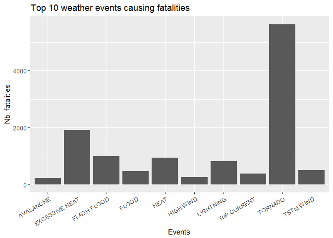
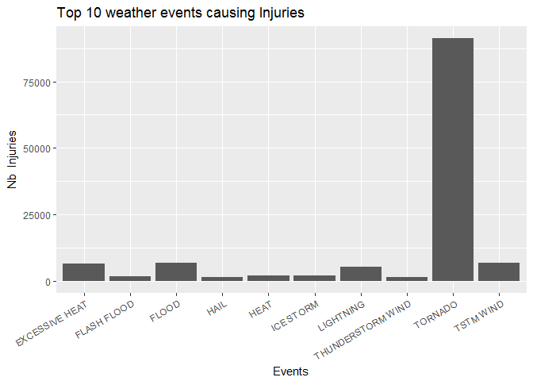
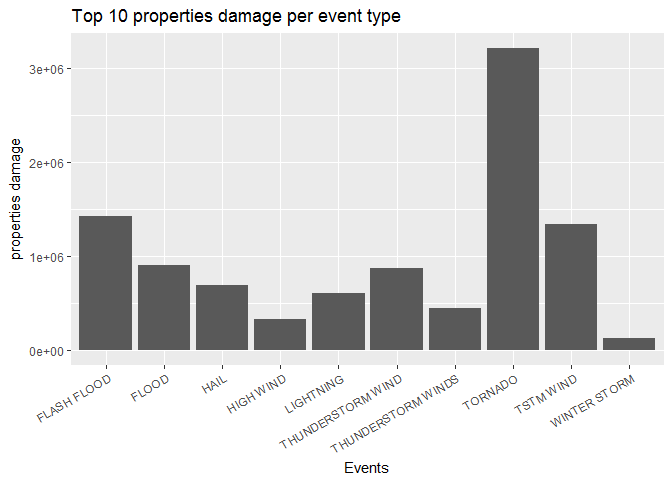

    
#1. Synopsys 
This project explores the U.S. National Oceanic and Atmospheric Administration's (NOAA) storm database in order to find which event cause the more death, injuries and damage. 

It appears that 
* Death are mainly cause by: Tornado, excessive heat and flood 
* Injuries are mainly cause by: Tornado, excessive heat and flood 
* Damage are mainly cause by:Tornado, wind and flood

#2. Introduction 
This project involves exploring the U.S. National Oceanic and Atmospheric Administration's (NOAA) storm database. This database tracks characteristics of major storms and weather events in the United States, including when and where they occur, as well as estimates of any fatalities, injuries, and property damage.


#3. Loading the data

Load libraries 


```r
library("ggplot2")
```

Read the data 

```r
setwd("C:/datasciencecoursera/ReproducibleResearche/CourseProject2")
if (!file.exists('./data')) { dir.create('./data') }
if (!file.exists("data/repdata-data-StormData.csv.bz2")) {
  download.file("https://d396qusza40orc.cloudfront.net/repdata%2Fdata%2FStormData.csv.bz2", destfile="storm_data/repdata-data-StormData.csv.bz2", mode = "wb",  method = "curl")
}

dStorm <- read.csv("data/repdata-data-StormData.csv.bz2")
```

subset the data 

```r
make.names(colnames(dStorm))
```

```
##  [1] "STATE__"    "BGN_DATE"   "BGN_TIME"   "TIME_ZONE"  "COUNTY"    
##  [6] "COUNTYNAME" "STATE"      "EVTYPE"     "BGN_RANGE"  "BGN_AZI"   
## [11] "BGN_LOCATI" "END_DATE"   "END_TIME"   "COUNTY_END" "COUNTYENDN"
## [16] "END_RANGE"  "END_AZI"    "END_LOCATI" "LENGTH"     "WIDTH"     
## [21] "F"          "MAG"        "FATALITIES" "INJURIES"   "PROPDMG"   
## [26] "PROPDMGEXP" "CROPDMG"    "CROPDMGEXP" "WFO"        "STATEOFFIC"
## [31] "ZONENAMES"  "LATITUDE"   "LONGITUDE"  "LATITUDE_E" "LONGITUDE_"
## [36] "REMARKS"    "REFNUM"
```

```r
#remove unknown event 
dStorm <- subset(x=dStorm, subset=(EVTYPE != "?"))

# Subset on the parameters of interest.
dStorm <- subset(x=dStorm,
                 select = c("EVTYPE", "FATALITIES", "INJURIES", "PROPDMG"))  
```

#4. Analysis of the data 

##4.1. Across the United States, which types of events (as indicated in the EVTYPE variable) are most harmful with respect to population health?
###4.1.1 Data processing 

```r
#Fatalities 
dFatalities <- aggregate(dStorm$FATALITIES, 
                         by=list(dStorm$EVTYPE), 
                         FUN=sum, 
                         na.rm=TRUE)
colnames(dFatalities) <- c("Event.Type", "Nb.Fatalities")
dFatalities <- dFatalities[order(dFatalities$Nb.Fatalities, decreasing = TRUE),][1:10, ]

#Injuries  
dInjuries <- aggregate(dStorm$INJURIES, 
                         by=list(dStorm$EVTYPE), 
                         FUN=sum, 
                         na.rm=TRUE)
colnames(dInjuries) <- c("Event.Type", "Nb.Injuries")
dInjuries <- dInjuries[order(dInjuries$Nb.Injuries, decreasing = TRUE),][1:10, ]
```

###4.1.2 Results 
#### Death causes 

```r
ggplot() + geom_bar(data = dFatalities, aes(x = Event.Type, y = Nb.Fatalities), stat="identity") + 
    geom_bar() + 
    theme(axis.text.x = element_text(angle = 30, hjust = 1)) + 
    xlab("Events") + 
    ylab("Nb  fatalities") + 
    ggtitle("Top 10 weather events causing fatalities") + 
    theme(axis.text.x = element_text(angle = 30, hjust = 1)) 
```

<!-- -->

#### Injuries causes 

```r
ggplot() + geom_bar(data = dInjuries, aes(x = Event.Type, y = Nb.Injuries), stat="identity") + 
    geom_bar() + 
    theme(axis.text.x = element_text(angle = 30, hjust = 1)) + 
    xlab("Events") + 
    ylab("Nb  Injuries") + 
    ggtitle("Top 10 weather events causing Injuries") + 
    theme(axis.text.x = element_text(angle = 30, hjust = 1)) 
```

<!-- -->


##4.2. Across the United States, which types of events have the greatest economic consequences?
###4.2.1 Data processing 

```r
dDamage <- aggregate(dStorm$PROPDMG, 
                         by=list(dStorm$EVTYPE), 
                         FUN=sum, 
                         na.rm=TRUE)
colnames(dDamage) <- c("Event.Type", "Damage")
dDamage <- dDamage[order(dDamage$Damage, decreasing = TRUE),][1:10, ]
```

###4.2.1 Results

```r
ggplot() + geom_bar(data = dDamage, aes(x = Event.Type, y = Damage), stat="identity") + 
    geom_bar() + 
    theme(axis.text.x = element_text(angle = 30, hjust = 1)) + 
    xlab("Events") + 
    ylab("properties damage") + 
    ggtitle("Top 10 properties damage per event type") + 
    theme(axis.text.x = element_text(angle = 30, hjust = 1))
```

<!-- -->

